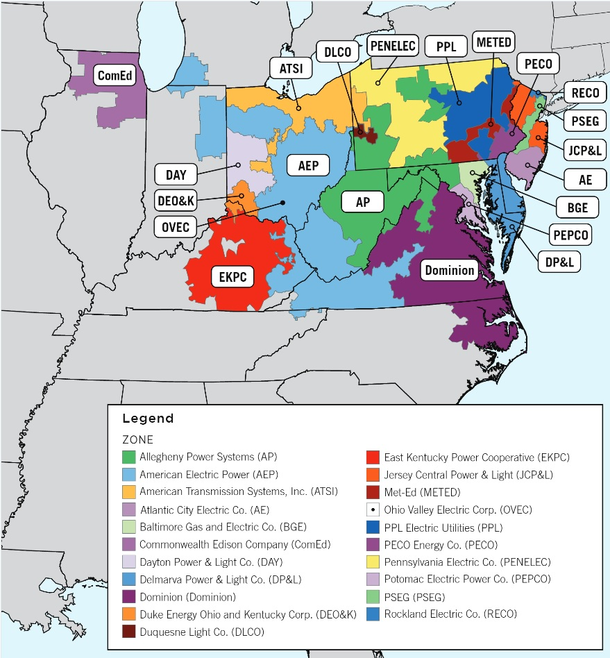

# Time-Series
**For the completion of UC Riverside's Master's Thesis**  
PJM Interconnection LLC (PJM) is a regional transmission organization (RTO) in the United States. It is part of the Eastern Interconnection grid operating an electric transmission system serving all or parts of Delaware, Illinois, Indiana, Kentucky, Maryland, Michigan, New Jersey, North Carolina, Ohio, Pennsylvania, Tennessee, Virginia, West Virginia, and the District of Columbia.  

The hourly power consumption data comes from PJM's website and are in megawatts (MW).  
*The regions have changed over the years so data may only appear for certain dates per region.*

# Map of the zones PJM serves

# Data Structure

Datetime | zone_load_MW | tmpf | hour | month | dayofweek  
-------- | -------------| ---- | ---- | ----- | --------
2004-10-02 00:00:00 | 13147.0 | 69.08 | 0 | 10 | 2 

# Goals

## To Do
- Visualize lag plots to see if autocorelation is present
- Split dataset to test/train
- Build model
- Validate model

## Completed 
- Check null/missing values in load profile.
- Merge load data to temperature data using datetime as key.
- Drop null values created from merge
